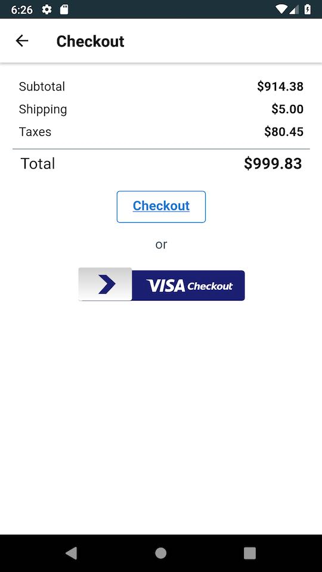
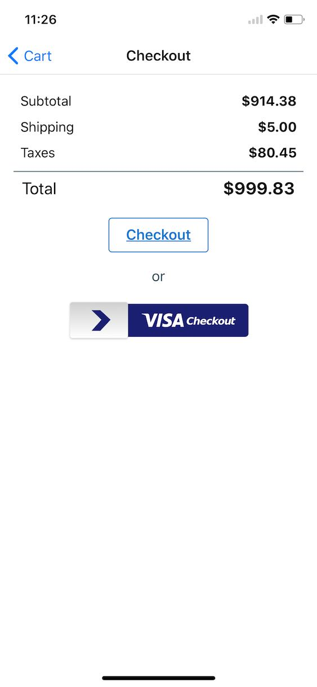
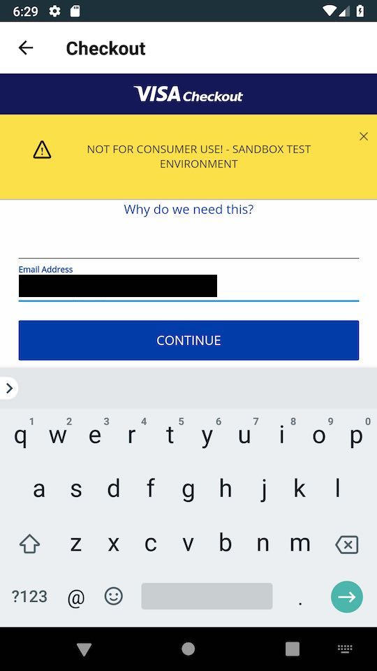

# RNWebViewWithVisaCheckout

_Testing [Visa’s Checkout](https://developer.visa.com/capabilities/visa_checkout) SDK in a React Native WebView_

## Workflow

The following details this repository's workflow between a React Native application and Visa Checkout's JavaScript SDK.

### 1. Cart

This is a 100% React Native view powered by stubbed products. Pressing the “Continue” button animates to the next view by triggering a navigation action. (Navigation is powered by [react-navigation](https://reactnavigation.org) in this example.)

|Android|iOS|
|:---:|:---:|
|||

### 2. Checkout

The content of this view is a [React Native WebView](https://facebook.github.io/react-native/docs/webview); its web page is rendered by the server. The “Checkout” button is included for display purposes and does not function. The server renders the “Visa Checkout” button per [Visa’s integration guide](https://developer.visa.com/capabilities/visa_checkout/docs#adding_visa_checkout_to_your_web_page).

|Android|iOS|
|:---:|:---:|
|||

### 3. Visa Flow

Pressing the “Visa Checkout” button leads the user into Visa’s flow (these screenshots show a repeat customer flow). This happens in the same Checkout WebView.

|Android|iOS|
|:---:|:---:|
|||
|||
|||
|||

The user enters authentication credentials, selects a payment method stored within Visa Checkout, and presses “Continue,” returning to the original web page. Visa offers new user signup and payment method editing/updating workflows, too.

### 4. Successful Payment

The Visa Checkout SDK sends a `payment.success` event containing encrypted payment method data to a registered handler within the WebView. This handler passes the data back to the native application using [the WebView’s `onMessage` property](https://facebook.github.io/react-native/docs/webview#onmessage), which passes the data to the server. The server decrypts the payment method using a secret Visa Checkout key and stores it for processing.

### 5. Order Confirmation

The client contacts the server to retrieve payment processing status, then displays a successful order confirmation view. _(Note: working code awaiting a “full” access account from Visa Developer relations.)_

## Setup

Make sure you have:

* [Node.js](https://nodejs.org/en/) (>= 8.x.x)
* [yarn](https://yarnpkg.com/en/)
* [Xcode](https://developer.apple.com/xcode/) (>= 9)
* [Android Studio](https://developer.android.com/studio/) (>= 3.1)

### Visa

1. Sign up for a test account at [developer.visa.com](https://developer.visa.com)
2. Create a new project within the Visa developer dashboard with “Visa Checkout” enabled
3. Add the newly created project's API key and shared secret as env var entries in _server/.env_:

    ```shell
    echo 'VISA_CHECKOUT_API_KEY=<your key>' > server/.env
    echo 'VISA_CHECKOUT_SHARED_SECRET=<your secret>' >> server/.env
    ```

### Web Server

To test the Visa Checkout SDK properly the server must run on a real host:

> **Note:** The page you add a Visa Checkout button to must be hosted on a web server for the lightbox and JavaScript library to perform properly.

— [_Visa Checkout_ documentation](https://developer.visa.com/capabilities/visa_checkout/docs#adding_visa_checkout_to_your_web_page)

To make this work for local development, the server should run on a test domain, `dev.walmart.com`. Add this entry to `/etc/hosts`:

```
127.0.0.1       dev.walmart.com
```

### Dependencies

Use [yarn](https://yarnpkg.com/en/) to install dependencies:

```shell
yarn install # root dependencies
yarn install --cwd "$PWD/client" # client dependencies
yarn install --cwd "$PWD/server" # server dependencies
```

## Running

Running the project requires both a server and client:

* **Server**: run `yarn start` in _server/_
* **Client**:
    * run `yarn start` in _client/_ to start the react-native packager
    * run `yarn run react-native run-ios` in _client/_ to start and build for the iOS simulator
    * run `yarn run react-native run-andriod` in _client/_ to start and build for the Android emulator
